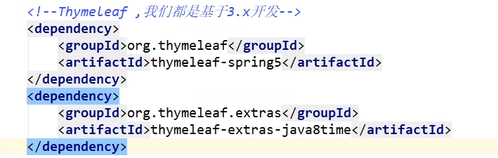

**1、yaml**

**1.1、语法**

{width="5.694444444444445in"
height="2.9301509186351704in"}

**1.2、yaml给实体类赋值**

{width="5.694444444444445in"
height="1.7576246719160105in"}

{width="5.694444444444445in"
height="2.3257010061242345in"}

**2、jsr303**

{width="5.694444444444445in"
height="3.0344892825896763in"}

**3、多环境配置**

{width="5.694444444444445in"
height="1.382813867016623in"}

**3.1、**

{width="5.694444444444445in"
height="1.9686679790026247in"}

**3.2、yaml格式：**

{width="5.694444444444445in"
height="3.5927548118985126in"}

**4、web开发**

**4.1、静态资源导入**

{width="5.694444444444445in"
height="2.0427088801399824in"}

**4.2、index首页问题**

{width="5.694444444444445in"
height="2.241683070866142in"}

**4.2、thymeleaf**

用法：

导入依赖：

{width="5.694444444444445in"
height="1.8071227034120736in"}

导入约束：

{width="5.694444444444445in"
height="0.7851290463692039in"}

规范：

{width="5.694444444444445in"
height="5.9756517935258096in"}

{width="5.694444444444445in"
height="3.8944280402449696in"}
