**1、回顾servlet**

**导入依赖：**

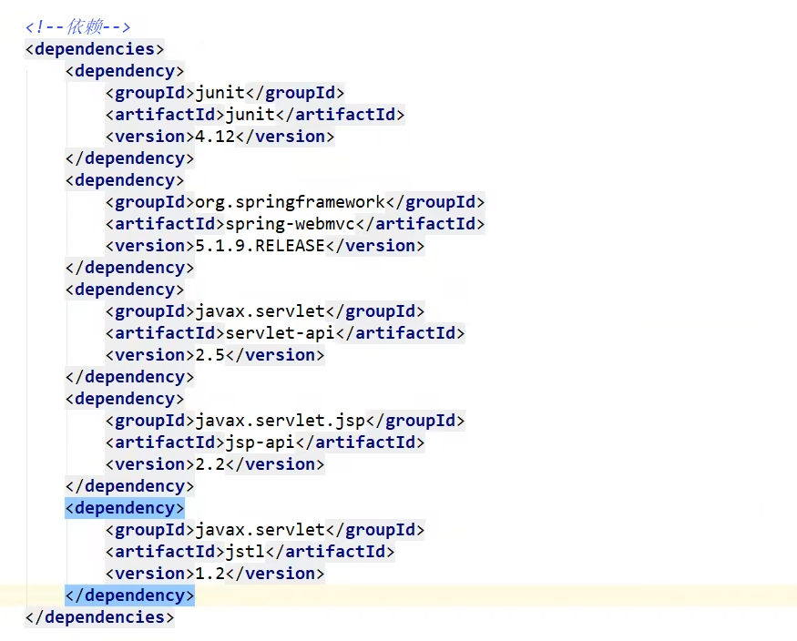{width="5.694444444444445in"
height="4.581587926509187in"}

**配置web：**

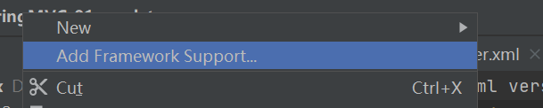{width="3.1805555555555554in"
height="0.6371555118110236in"}

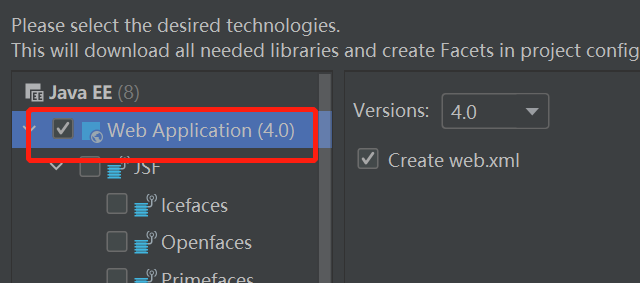{width="3.236111111111111in"
height="1.4309678477690289in"}

**配置servlet：**

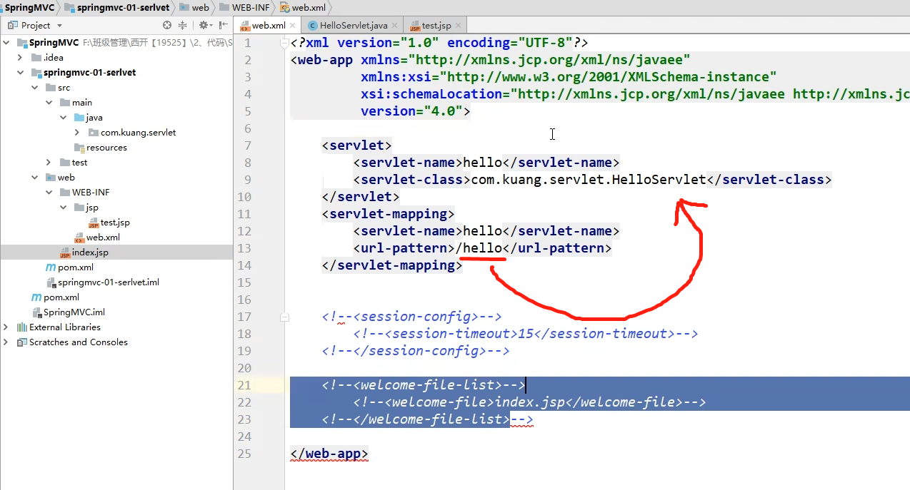{width="5.694444444444445in"
height="3.070709755030621in"}

**编写servlet：**

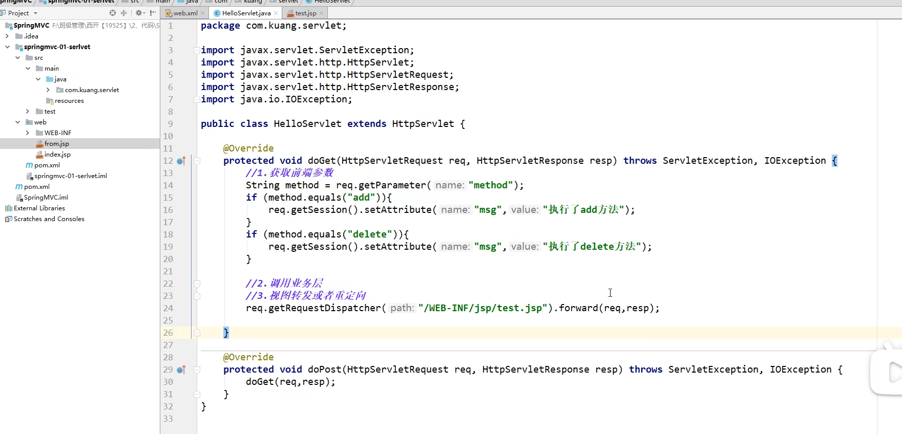{width="5.694444444444445in"
height="2.7421292650918634in"}

**MVC要做的事：**

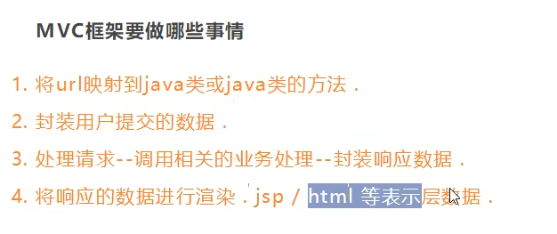{width="3.9583333333333335in"
height="1.6630063429571305in"}

**2、SpringMVC**

SpringMVC必须配置的三大件：处理器映射器、处理器适配器、视图解析器。

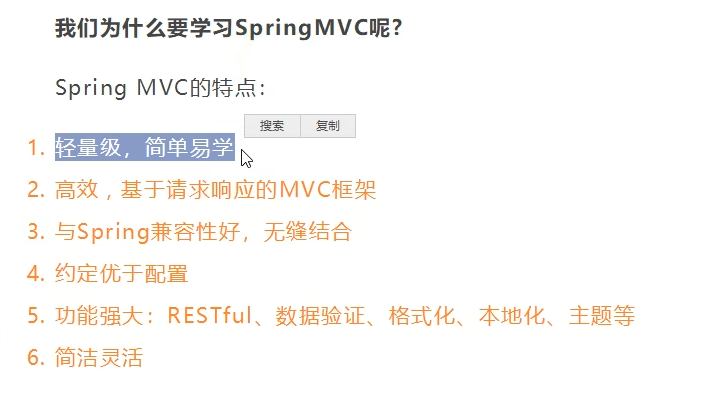{width="3.9305555555555554in"
height="2.1973097112860893in"}

**1、原理：**

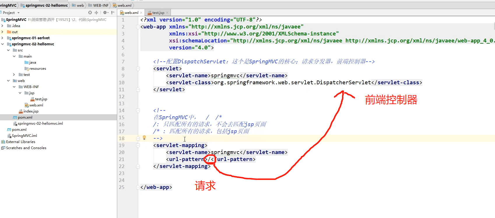{width="3.9305555555555554in"
height="1.7361111111111112in"}

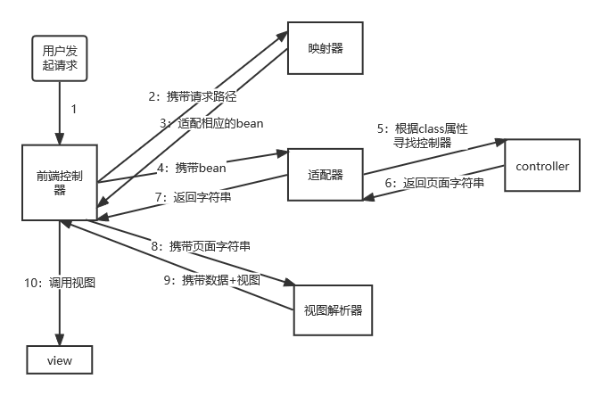{width="5.760416666666667in"
height="3.789074803149606in"}

**2、使用@Controller注解：**

\@Controller注解类型用于声明Spring类的实例是一个控制器（在讲IOC时还提到了另外3个注解：@Component、@Service、@Repository）；

Spring可以使用扫描机制来找到应用程序中所有基于注解的控制器类，为了保证Spring能找到你的控制器，需要在配置文件中声明组件扫描。

\<!-- 自动扫描指定的包，下面所有注解类交给IOC容器管理 --\>

\<context:component-scan base-package="com.kuang.controller"/\>

**3、restful风格：**

**概念**

Restful就是一个资源定位及资源操作的风格。不是标准也不是协议，只是一种风格。基于这个风格设计的软件可以更简洁，更有层次，更易于实现缓存等机制。

**功能**

资源：互联网所有的事物都可以被抽象为资源

资源操作：使用POST、DELETE、PUT、GET，使用不同方法对资源进行操作。

分别对应 添加、 删除、修改、查询。

**传统方式操作资源  ：通过不同的参数来实现不同的效果！方法单一，post 和
get**

h[ttp://127.0.0.1/item/queryItem.action?id=1](http://127.0.0.1/item/queryItem.action?id=1)
查询,GET

h[ttp://127.0.0.1/item/saveItem.action](http://127.0.0.1/item/saveItem.action)
新增,POST

h[ttp://127.0.0.1/item/updateItem.action](http://127.0.0.1/item/updateItem.action)
更新,POST

h[ttp://127.0.0.1/item/deleteItem.action?id=1](http://127.0.0.1/item/deleteItem.action?id=1)
删除,GET或POST

**使用RESTful操作资源
：可以通过不同的请求方式来实现不同的效果！如下：请求地址一样，但是功能可以不同！**

h[ttp://127.0.0.1/item/1](http://127.0.0.1/item/1) 查询,GET

h[ttp://127.0.0.1/item](http://127.0.0.1/item) 新增,POST

h[ttp://127.0.0.1/item](http://127.0.0.1/item) 更新,PUT

h[ttp://127.0.0.1/item/1](http://127.0.0.1/item/1) 删除,DELETE

**\@PathVariable 注解:**

在Spring MVC中可以使用  @PathVariable
注解，让方法参数的值对应绑定到一个URI模板变量上。

\@Controller

public class RestFulController {

   //映射访问路径

   @RequestMapping("/commit/{p1}/{p2}")

 
 public String index(@PathVariable int p1, @PathVariable int p2, Model model){

       

       int result = p1+p2;

       //Spring MVC会自动实例化一个Model对象用于向视图中传值

       model.addAttribute("msg", "结果："+result);

       //返回视图位置

       return "test";

  }

}

**使用method属性指定请求类型:**

此时如果我们使用浏览器地址栏进行访问默认是Get请求，会报错405

//映射访问路径,必须是POST请求

\@RequestMapping(value = "/hello",method = {RequestMethod.POST})

public String index2(Model model){

   model.addAttribute("msg", "hello!");

   return "test";

}

**小结：**

Spring MVC 的 \@RequestMapping 注解能够处理 HTTP 请求的方法, 比如 GET,
PUT, POST, DELETE 以及 PATCH。

**所有的地址栏请求默认都会是 HTTP GET 类型的。**

方法级别的注解变体有如下几个：组合注解

\@GetMapping

\@PostMapping

\@PutMapping

\@DeleteMapping

\@PatchMapping

\@GetMapping 是一个组合注解，平时使用的会比较多！

它所扮演的是 \@RequestMapping(method =RequestMethod.GET)
的一个快捷方式。

**4、重定向和转发：**

> **ModelAndView**
>
> 设置ModelAndView对象 , 根据view的名称 , 和视图解析器跳到指定的页面 .
>
> 页面 : {视图解析器前缀} + viewName +{视图解析器后缀}

\<!-- 视图解析器 --\>

\<bean class="org.springframework.web.servlet.view.InternalResourceViewResolver"

     id="internalResourceViewResolver"\>

   \<!-- 前缀 --\>

   \<property name="prefix" value="/WEB-INF/jsp/" /\>

   \<!-- 后缀 --\>

   \<property name="suffix" value=".jsp" /\>

\</bean\>

对应的controller类

public class ControllerTest1 implements Controller {

 
 public ModelAndView handleRequest(HttpServletRequest httpServletRequest, HttpServletResponse httpServletResponse) throws Exception {

       //返回一个模型视图对象

       ModelAndView mv = new ModelAndView();

       mv.addObject("msg","ControllerTest1");

       mv.setViewName("test");

       return mv;

  }

}

> **ServletAPI**
>
> 通过设置ServletAPI , 不需要视图解析器 .
>
> 1、通过HttpServletResponse进行输出
>
> 2、通过HttpServletResponse实现重定向
>
> 3、通过HttpServletResponse实现转发

\@Controller

public class ResultGo {

   @RequestMapping("/result/t1")

 
 public void test1(HttpServletRequest req, HttpServletResponse rsp) throws IOException {

       rsp.getWriter().println("Hello,Spring BY servlet API");

  }

   @RequestMapping("/result/t2")

 
 public void test2(HttpServletRequest req, HttpServletResponse rsp) throws IOException {

       rsp.sendRedirect("/index.jsp");

  }

   @RequestMapping("/result/t3")

 
 public void test3(HttpServletRequest req, HttpServletResponse rsp) throws Exception {

       //转发

       req.setAttribute("msg","/result/t3");

     
 req.getRequestDispatcher("/WEB-INF/jsp/test.jsp").forward(req,rsp);

  }

}

**SpringMVC**

> **通过SpringMVC来实现转发和重定向 - 无需视图解析器；**
>
> 测试前，需要将视图解析器注释掉

\@Controller

public class ResultSpringMVC {

   @RequestMapping("/rsm/t1")

   public String test1(){

       //转发

       return "/index.jsp";

  }

   @RequestMapping("/rsm/t2")

   public String test2(){

       //转发二

       return "forward:/index.jsp";

  }

   @RequestMapping("/rsm/t3")

   public String test3(){

       //重定向

       return "redirect:/index.jsp";

  }

}

> **通过SpringMVC来实现转发和重定向 - 需要视图解析器；**
>
> 重定向 , 不需要视图解析器 , 本质就是重新请求一个新地方嘛 ,
> 所以注意路径问题.
>
> 可以重定向到另外一个请求实现 .

\@Controller

public class ResultSpringMVC2 {

   @RequestMapping("/rsm2/t1")

   public String test1(){

       //转发

       return "test";

  }

   @RequestMapping("/rsm2/t2")

   public String test2(){

       //重定向

       return "redirect:/index.jsp";

       //return "redirect:hello.do"; //hello.do为另一个请求/

  }

}

**5、数据处理：**

**处理提交数据**

> **1、提交的域名称和处理方法的参数名一致**
>
> 提交数据 :
> [[http://localhost:8080/hello?name=wzx]{.underline}](http://localhost:8080/hello?name=wzx)
>
> 处理方法 :

\@RequestMapping("/hello")

public String hello(String name){

   System.out.println(name);

   return "hello";

}

后台输出 : wzx

> **2、提交的域名称和处理方法的参数名不一致**
>
> 提交数据 :
> [[http://localhost:8080/hello?username=wzx]{.underline}](http://localhost:8080/hello?username=wzx)
>
> 处理方法 :

//@RequestParam("username") : username提交的域的名称 .

\@RequestMapping("/hello")

public String hello(@RequestParam("username") String name){

   System.out.println(name);

   return "hello";

}

后台输出 : wzx

> **3、提交的是一个对象**
>
> 要求提交的表单域和对象的属性名一致  , 参数使用对象即可
>
> 1、实体类

public class User {

   private int id;

   private String name;

   private int age;

   //构造

   //get/set

   //tostring()

}

> 2、提交数据 :
> [[http://localhost:8080/mvc04/user?name=wzx&id=1&age=15]{.underline}](http://localhost:8080/mvc04/user?name=wzx&id=1&age=15)
>
> 3、处理方法 :

\@RequestMapping("/user")

public String user(User user){

   System.out.println(user);

   return "hello";

}

> 后台输出 : User { id=1, name='wzx', age=15 }
>
> 说明：如果使用对象的话，前端传递的参数名和对象名必须一致(即url的参数名和实体类的属性名)，否则就是null。

**6、数据显示到前端**

**第一种 : 通过ModelAndView**

我们前面一直都是如此 . 就不过多解释

public class ControllerTest1 implements Controller {

 
 public ModelAndView handleRequest(HttpServletRequest httpServletRequest, HttpServletResponse httpServletResponse) throws Exception {

       //返回一个模型视图对象

       ModelAndView mv = new ModelAndView();

       mv.addObject("msg","ControllerTest1");

       mv.setViewName("test");

       return mv;

  }

}

**第二种 : 通过ModelMap**

ModelMap

\@RequestMapping("/hello")

public String hello(@RequestParam("username") String name, ModelMap model){

   //封装要显示到视图中的数据

   //相当于req.setAttribute("name",name);

   model.addAttribute("name",name);

   System.out.println(name);

   return "hello";

}

**第三种 : 通过Model**

Model

\@RequestMapping("/ct2/hello")

public String hello(@RequestParam("username") String name, Model model){

   //封装要显示到视图中的数据

   //相当于req.setAttribute("name",name);

   model.addAttribute("msg",name);

   System.out.println(name);

   return "test";

}

**对比**

就对于新手而言简单来说使用区别就是：

Model
只有寥寥几个方法只适合用于储存数据，简化了新手对于Model对象的操作和理解；

ModelMap 继承了 LinkedMap ，除了实现了自身的一些方法，同样的继承
LinkedMap 的方法和特性；

ModelAndView
可以在储存数据的同时，可以进行设置返回的逻辑视图，进行控制展示层的跳转。

当然更多的以后开发考虑的更多的是性能和优化，就不能单单仅限于此的了解。

**7、乱码问题：**

注意：以下建立在客户端已经修改成utf8形式：

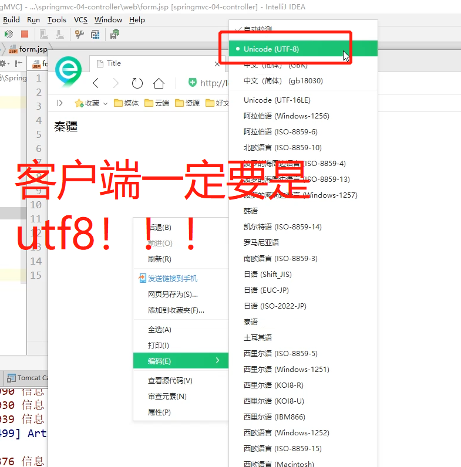{width="3.9305555555555554in"
height="3.9856332020997374in"}

> **7.1、使用SpringMVC自带的过滤器(这个过滤器对get的支持不好 )：**
>
> 于web.xml中添加：

\<filter\>

   \<filter-name\>encoding\</filter-name\>

 
 \<filter-class\>org.springframework.web.filter.CharacterEncodingFilter\</filter-class\>

   \<init-param\>

       \<param-name\>encoding\</param-name\>

       \<param-value\>utf-8\</param-value\>

   \</init-param\>

\</filter\>

\<filter-mapping\>

   \<filter-name\>encoding\</filter-name\>

   \<url-pattern\>/\*\</url-pattern\>

\</filter-mapping\>

**7.2、修改tomcat配置文件：**

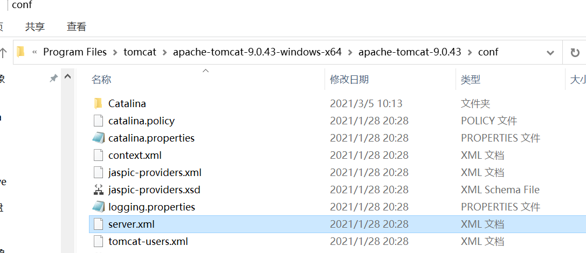{width="3.9305555555555554in"
height="1.699504593175853in"}

\<Connector URIEncoding="utf-8" port="8080" protocol="HTTP/1.1"

          connectionTimeout="20000"

          redirectPort="8443" /\>

**7.3、自定义过滤器(某大佬杰作)：**

package com.kuang.filter;

import javax.servlet.\*;

import javax.servlet.http.HttpServletRequest;

import javax.servlet.http.HttpServletRequestWrapper;

import javax.servlet.http.HttpServletResponse;

import java.io.IOException;

import java.io.UnsupportedEncodingException;

import java.util.Map;

/\*\*

\* 解决get和post请求 全部乱码的过滤器

\*/

public class GenericEncodingFilter implements Filter {

   @Override

   public void destroy() {

  }

   @Override

 
 public void doFilter(ServletRequest request, ServletResponse response, FilterChain chain) throws IOException, ServletException {

       //处理response的字符编码

       HttpServletResponse myResponse=(HttpServletResponse) response;

       myResponse.setContentType("text/html;charset=UTF-8");

       // 转型为与协议相关对象

     
 HttpServletRequest httpServletRequest = (HttpServletRequest) request;

       // 对request包装增强

       HttpServletRequest myrequest = new MyRequest(httpServletRequest);

       chain.doFilter(myrequest, response);

  }

   @Override

   public void init(FilterConfig filterConfig) throws ServletException {

  }

}

//自定义request对象，HttpServletRequest的包装类

class MyRequest extends HttpServletRequestWrapper {

   private HttpServletRequest request;

   //是否编码的标记

   private boolean hasEncode;

   //定义一个可以传入HttpServletRequest对象的构造函数，以便对其进行装饰

   public MyRequest(HttpServletRequest request) {

       super(request);// super必须写

       this.request = request;

  }

   // 对需要增强方法 进行覆盖

   @Override

   public Map getParameterMap() {

       // 先获得请求方式

       String method = request.getMethod();

       if (method.equalsIgnoreCase("post")) {

           // post请求

           try {

               // 处理post乱码

               request.setCharacterEncoding("utf-8");

               return request.getParameterMap();

          } catch (UnsupportedEncodingException e) {

               e.printStackTrace();

          }

      } else if (method.equalsIgnoreCase("get")) {

           // get请求

         
 Map\<String, String\[\]\> parameterMap = request.getParameterMap();

           if (!hasEncode) { // 确保get手动编码逻辑只运行一次

               for (String parameterName : parameterMap.keySet()) {

                   String\[\] values = parameterMap.get(parameterName);

                   if (values != null) {

                       for (int i = 0; i \< values.length; i++) {

                           try {

                               // 处理get乱码

                               values\[i\] = new String(values\[i\]

                                      .getBytes("ISO-8859-1"), "utf-8");

                          } catch (UnsupportedEncodingException e) {

                               e.printStackTrace();

                          }

                      }

                  }

              }

               hasEncode = true;

          }

           return parameterMap;

      }

       return super.getParameterMap();

  }

   //取一个值

   @Override

   public String getParameter(String name) {

       Map\<String, String\[\]\> parameterMap = getParameterMap();

       String\[\] values = parameterMap.get(name);

       if (values == null) {

           return null;

      }

       return values\[0\]; // 取回参数的第一个值

  }

   //取所有值

   @Override

   public String\[\] getParameterValues(String name) {

       Map\<String, String\[\]\> parameterMap = getParameterMap();

       String\[\] values = parameterMap.get(name);

       return values;

  }

}

于wen.xml中配置：

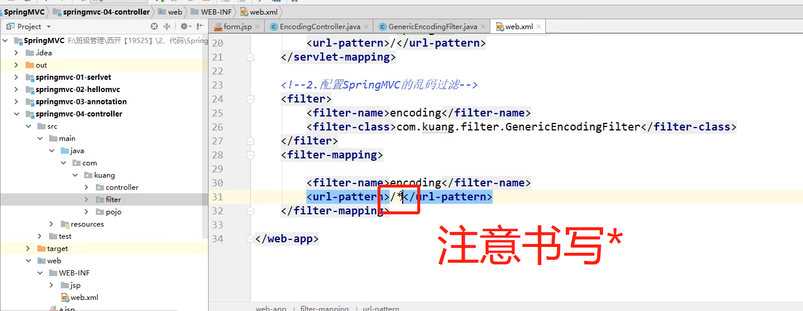{width="3.9305555555555554in"
height="1.5275962379702537in"}

**7.4、使用API接口过滤器解决get请求：**

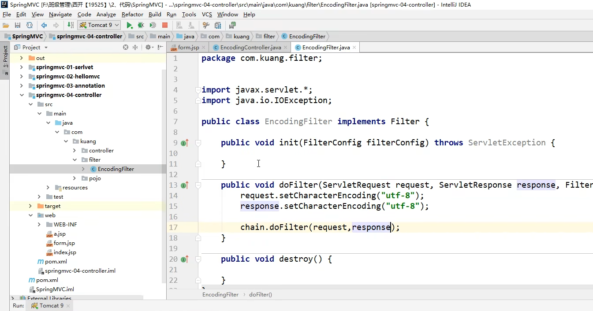{width="3.9305555555555554in"
height="2.063176946631671in"}

在bean中注册：

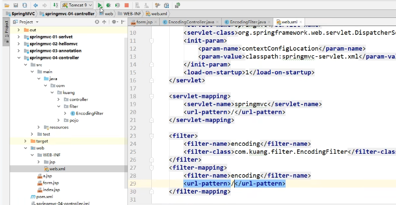{width="3.9305555555555554in"
height="2.042104111986002in"}

**8、JSON交互处理：**

一种数据转化的格式：

JSON 是 JavaScript 对象的字符串表示法，它使用文本表示一个 JS
对象的信息，本质是一个字符串。

var obj = {a: 'Hello', b: 'World'}; //这是一个对象，注意键名也是可以使用引号包裹的

var json = '{"a": "Hello", "b": "World"}'; //这是一个 JSON
字符串，本质是一个字符串

**1、JSON 和 JavaScript 对象互转**

// JSON字符串转换为JavaScript 对象，使用 JSON.parse() 方法：

var obj = JSON.parse('{"a": "Hello", "b": "World"}'); // 结果是 {a:
'Hello', b: 'World'}

// JavaScript 对象转换为JSON字符串，使用 JSON.stringify() 方法：

var json = JSON.stringify({a: 'Hello', b: 'World'}); //结果是 '{"a":
"Hello", "b": "World"}'

**2、使用Jackson解析工具**

导入依赖：

\<!--
<https://mvnrepository.com/artifact/com.fasterxml.jackson.core/jackson-core>
--\>

\<depe[ndency\>](https://mvnrepository.com/artifact/com.fasterxml.jackson.core/jackson-core)

 
 \<g[roupId\>com.fasterxml.jackson.core\</groupId\>](https://mvnrepository.com/artifact/com.fasterxml.jackson.core/jackson-core)

 
 \<a[rtifactId\>jackson-databind\</artifactId\>](https://mvnrepository.com/artifact/com.fasterxml.jackson.core/jackson-core)

 
 \<v[ersion\>2.9.8\</version\>](https://mvnrepository.com/artifact/com.fasterxml.jackson.core/jackson-core)

\</dep[endency\>](https://mvnrepository.com/artifact/com.fasterxml.jackson.core/jackson-core)

**3、json乱码问题：**

3.1、通过@RequestMaping的produces属性来实现：

//produces:指定响应体返回类型和编码

\@RequestMapping(value = "/json1",produces = "application/json;charset=utf-8")

3.2、在springmvc的配置文件上添加一段消息StringHttpMessageConverter转换配置：

\<mvc:annotation-driven\>

   \<mvc:message-converters register-defaults="true"\>

     
 \<bean class="org.springframework.http.converter.StringHttpMessageConverter"\>

           \<constructor-arg value="UTF-8"/\>

       \</bean\>

     
 \<bean class="org.springframework.http.converter.json.MappingJackson2HttpMessageConverter"\>

           \<property name="objectMapper"\>

             
 \<bean class="org.springframework.http.converter.json.Jackson2ObjectMapperFactoryBean"\>

                   \<property name="failOnEmptyBeans" value="false"/\>

               \</bean\>

           \</property\>

       \</bean\>

   \</mvc:message-converters\>

\</mvc:annotation-driven\>

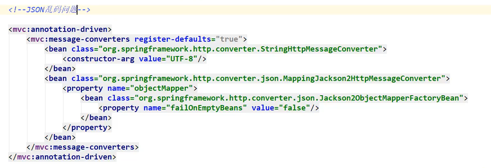{width="3.9305555555555554in"
height="1.3484623797025372in"}

**4、不走视图解析器方法（返回json字符串统一解决）：**

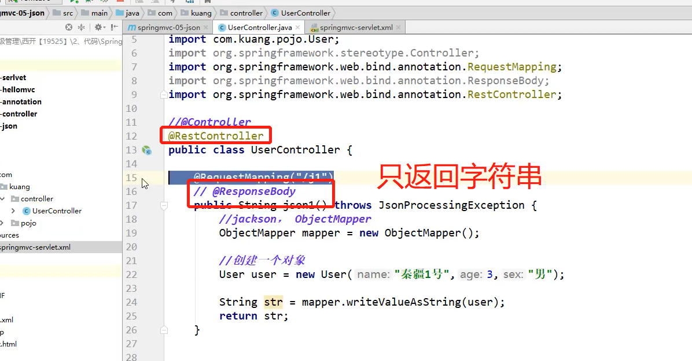{width="3.9305555555555554in"
height="2.0572976815398074in"}

**5、封装工具类：**

package com.wzx.utils;

import com.fasterxml.jackson.core.JsonProcessingException;

import com.fasterxml.jackson.databind.ObjectMapper;

import com.fasterxml.jackson.databind.SerializationFeature;

import java.text.SimpleDateFormat;

public class JsonUtils {

   

   public static String getJson(Object object) {

       return getJson(object,"yyyy-MM-dd HH:mm:ss");

  }

   public static String getJson(Object object,String dateFormat) {

       ObjectMapper mapper = new ObjectMapper();

       //不使用时间差的方式

     
 mapper.configure(SerializationFeature.WRITE_DATES_AS_TIMESTAMPS, false);

       //自定义日期格式对象

       SimpleDateFormat sdf = new SimpleDateFormat(dateFormat);

       //指定日期格式

       mapper.setDateFormat(sdf);

       try {

           return mapper.writeValueAsString(object);

      } catch (JsonProcessingException e) {

           e.printStackTrace();

      }

       return null;

  }

}

使用工具类：

\@RequestMapping("/json5")

public String json5() throws JsonProcessingException {

   Date date = new Date();

   String json = JsonUtils.getJson(date);

   return json;

}

**6、FastJson：**

fastjson.jar是阿里开发的一款专门用于Java开发的包，可以方便的实现json对象与JavaBean对象的转换，实现JavaBean对象与json字符串的转换，实现json对象与json字符串的转换。实现json的转换方法很多，最后的实现结果都是一样的。

fastjson 的 pom依赖！

\<dependency\>

   \<groupId\>com.alibaba\</groupId\>

   \<artifactId\>fastjson\</artifactId\>

   \<version\>1.2.60\</version\>

\</dependency\>

fastjson 三个主要的类：

**JSONObject  代表 json 对象**

JSONObject实现了Map接口, 猜想 JSONObject底层操作是由Map实现的。

JSONObject对应json对象，通过各种形式的get()方法可以获取json对象中的数据，也可利用诸如size()，isEmpty()等方法获取"键：值"对的个数和判断是否为空。其本质是通过实现Map接口并调用接口中的方法完成的。

**JSONArray   代表 json 对象数组**

内部是有List接口中的方法来完成操作的。

**JSON代表 JSONObject和JSONArray的转化**

JSON类源码分析与使用

仔细观察这些方法，主要是实现json对象，json对象数组，javabean对象，json字符串之间的相互转化。

**代码测试，我们新建一个FastJsonDemo 类**

package com.kuang.controller;

import com.alibaba.fastjson.JSON;

import com.alibaba.fastjson.JSONObject;

import com.kuang.pojo.User;

import java.util.ArrayList;

import java.util.List;

public class FastJsonDemo {

   public static void main(String\[\] args) {

       //创建一个对象

       User user1 = new User("秦疆1号", 3, "男");

       User user2 = new User("秦疆2号", 3, "男");

       User user3 = new User("秦疆3号", 3, "男");

       User user4 = new User("秦疆4号", 3, "男");

       List\<User\> list = new ArrayList\<User\>();

       list.add(user1);

       list.add(user2);

       list.add(user3);

       list.add(user4);

       System.out.println("\*\*\*\*\*\*\*Java对象 转
JSON字符串\*\*\*\*\*\*\*");

       String str1 = JSON.toJSONString(list);

       System.out.println("JSON.toJSONString(list)==\>"+str1);

       String str2 = JSON.toJSONString(user1);

       System.out.println("JSON.toJSONString(user1)==\>"+str2);

       System.out.println("\\n\*\*\*\*\*\* JSON字符串 转
Java对象\*\*\*\*\*\*\*");

       User jp_user1=JSON.parseObject(str2,User.class);

     
 System.out.println("JSON.parseObject(str2,User.class)==\>"+jp_user1);

       System.out.println("\\n\*\*\*\*\*\* Java对象 转 JSON对象
\*\*\*\*\*\*");

       JSONObject jsonObject1 = (JSONObject) JSON.toJSON(user2);

       System.out.println("(JSONObject)
JSON.toJSON(user2)==\>"+jsonObject1.getString("name"));

       System.out.println("\\n\*\*\*\*\*\* JSON对象 转 Java对象
\*\*\*\*\*\*");

       User to_java_user = JSON.toJavaObject(jsonObject1, User.class);

       System.out.println("JSON.toJavaObject(jsonObject1,
User.class)==\>"+to_java_user);

  }

}

**0、前端提交数据：**

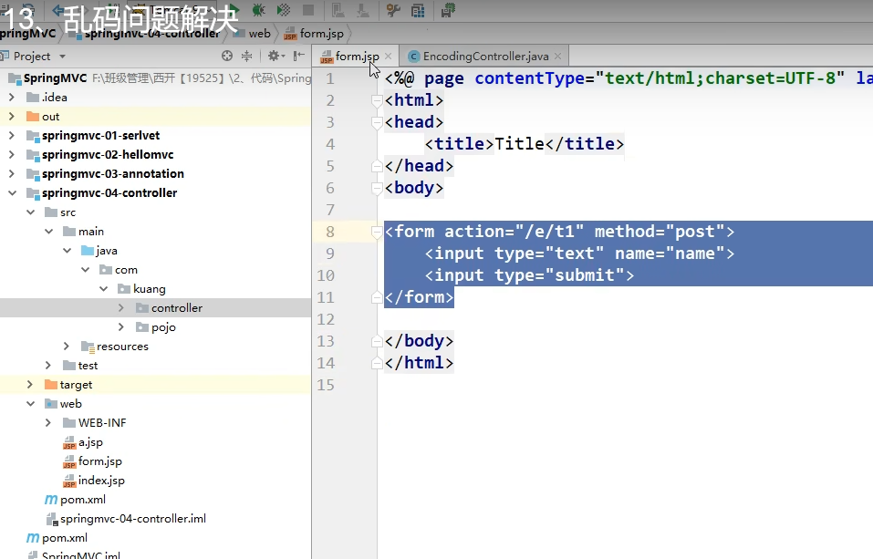{width="3.9305555555555554in"
height="2.517691382327209in"}

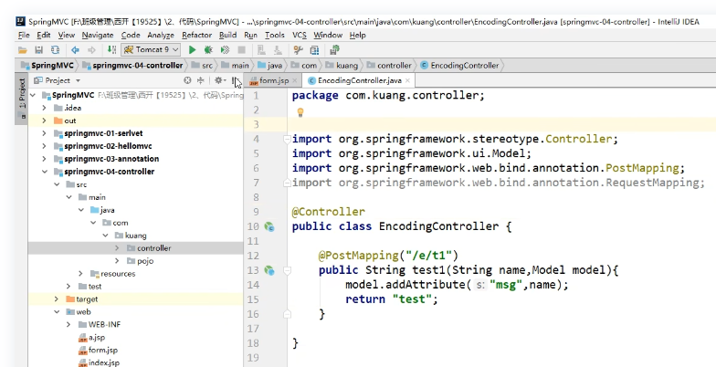{width="3.9305555555555554in"
height="2.0154122922134734in"}

**3、整合ssm**

一个接口对应一个mapper：

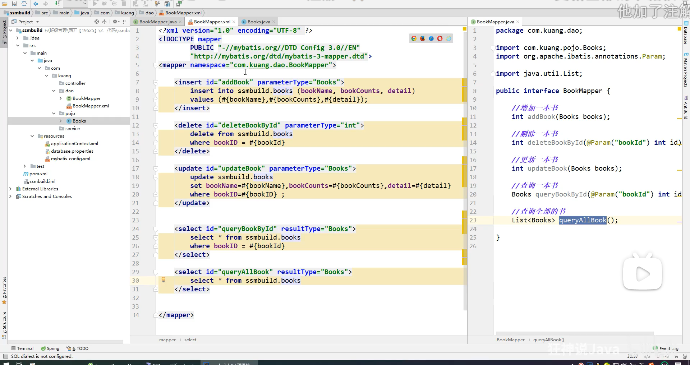{width="3.9166666666666665in"
height="2.0725699912510938in"}

**4、Ajax**

**4.1、作用：**

注册时，输入用户名自动检测用户是否已经存在。

登陆时，提示用户名密码错误

删除数据行时，将行ID发送到后台，后台在数据库中删除，数据库删除成功后，在页面DOM中将数据行也删除。

....等等

**4.2、jQuery.ajax**

Ajax的核心是XMLHttpRequest对象(XHR)。XHR为向服务器发送请求和解析服务器响应提供了接口。能够以异步方式从服务器获取新数据。

jQuery 提供多个与 AJAX 有关的方法。

通过 jQuery AJAX 方法，您能够使用 HTTP Get 和 HTTP Post
从远程服务器上请求文本、HTML、XML 或 JSON –
同时您能够把这些外部数据直接载入网页的被选元素中。

jQuery 不是生产者，而是大自然搬运工。

jQuery Ajax本质就是 XMLHttpRequest，对他进行了封装，方便调用！

jQuery.ajax(...)

      部分参数：

            url：请求地址

            type：请求方式，GET、POST（1.9.0之后用method）

        headers：请求头

            data：要发送的数据

    contentType：即将发送信息至服务器的内容编码类型(默认:
"application/x-www-form-urlencoded; charset=UTF-8")

          async：是否异步

        timeout：设置请求超时时间（毫秒）

      beforeSend：发送请求前执行的函数(全局)

        complete：完成之后执行的回调函数(全局)

        success：成功之后执行的回调函数(全局)

          error：失败之后执行的回调函数(全局)

       
accepts：通过请求头发送给服务器，告诉服务器当前客户端可接受的数据类型

        dataType：将服务器端返回的数据转换成指定类型

          "xml": 将服务器端返回的内容转换成xml格式

          "text": 将服务器端返回的内容转换成普通文本格式

          "html":
将服务器端返回的内容转换成普通文本格式，在插入DOM中时，如果包含JavaScript标签，则会尝试去执行。

        "script":
尝试将返回值当作JavaScript去执行，然后再将服务器端返回的内容转换成普通文本格式

          "json": 将服务器端返回的内容转换成相应的JavaScript对象

        "jsonp": JSONP 格式使用 JSONP 形式调用函数时，如
"myurl?callback=?" jQuery 将自动替换 ? 为正确的函数名，以执行回调函数

**4.3、一个简单的简单ajax**

**我们来个简单的测试，使用最原始的HttpServletResponse处理 , .最简单 ,
最通用**

1、配置web.xml 和 springmvc的配置文件，复制上面案例的即可
【记得静态资源过滤和注解驱动配置上】

\<?xml version="1.0" encoding="UTF-8"?\>

\<beans xmlns="http://www.springframework.org/schema/b[eans"](http://www.springframework.org/schema/beans)

   
  xmlns:xsi="http://www.w3.org/2001/XMLSchema-ins[tance"](http://www.springframework.org/schema/beans)

   
  xmlns:context="http://www.springframework.org/s[chema/context"](http://www.springframework.org/schema/beans)

   
  xmlns:mvc="http://www.springframework.org/schem[a/mvc"](http://www.springframework.org/schema/beans)

   
  xsi:schemaLocation="http://www.springframework.[org/schema/beans](http://www.springframework.org/schema/beans)

     
 http://www.springframework.org/schema/beans/sp[ring-beans.xsd](http://www.springframework.org/schema/beans)

       http://www.springframework.org/schema/context

     
 https://www.springframework.org/schema/context[/spring-context.xsd](http://www.springframework.org/schema/beans)

       http://www.springframework.org/schema/mvc

     
 https://www.springframework.org/schema/mvc/spr[ing-mvc.xsd"\>](http://www.springframework.org/schema/beans)

   \<!-- 自动扫描指定的包，下面所有注解类交给IOC容器管理 --\>

 
 \<context:component-scan base-package="com.kuang.co[ntroller"/\>](http://www.springframework.org/schema/beans)

   \<mvc:default-servlet-handler /\>

   \<mvc:annotation-driven /\>

   \<!-- 视图解析器 --\>

 
 \<bean class="org.springframework.web.servlet.view.[InternalResourceViewResolver"](http://www.springframework.org/schema/beans)

         id="internalResourceViewResolver"\>

       \<!-- 前缀 --\>

     
 \<property name="prefix" value="/WEB-INF/jsp/" [/\>](http://www.springframework.org/schema/beans)

       \<!-- 后缀 --\>

       \<property name="suffix" value=".jsp" /\>

   \</bean\>

\</beans\>

2、编写一个AjaxController

\@Controller

public class AjaxController {

   @RequestMapping("/a1")

 
 public void ajax1(String name , HttpServletResponse response) throws IOException {

       if ("admin".equals(name)){

           response.getWriter().print("true");

      }else{

           response.getWriter().print("false");

      }

  }

}

3、**导入jquery ， 可以使用在线的CDN ， 也可以下载导入**

\<script src="<https://code.jquery.com/jquery-3.1.1.min.js>"\>\</script\>

\<script src="[\${pageContext.request.contextPath}/statics/](https://code.jquery.com/jquery-3.1.1.min.js)js/jquery-3.1.1.min.js"\>\</script\>

4、编写index.jsp测试

\<%@ page contentType="text/html;charset=UTF-8" language="java" %\>

\<html\>

 \<head\>

   \<title\>\$Title\$\</title\>

 
\<%--\<script src="https://code.jquery.com/jquery-3.1.1.min.js"\>\</script\>--%\>

 
 \<script src="\${pageContext.request.contextPath}/statics/js/jquery-3.1.1.min.js"\>\</script\>

   \<script\>

       function a1(){

           \$.post({

               url:"\${pageContext.request.contextPath}/a1",

               data:{'name':\$("#txtName").val()},

               success:function (data,status) {

                   alert(data);

                   alert(status);

              }

          });

      }

   \</script\>

 \</head\>

 \<body\>

\<%--onblur：失去焦点触发事件--%\>

用户名:\<input type="text" id="txtName" onblur="a1()"/\>

 \</body\>

\</html\>

5、启动tomcat测试！打开浏览器的控制台，当我们鼠标离开输入框的时候，可以看到发出了一个ajax的请求！是后台返回给我们的结果！测试成功！

**4.4、Springmvc实现**

实体类user

\@Data

\@AllArgsConstructor

\@NoArgsConstructor

public class User {

   private String name;

   private int age;

   private String sex;

}

我们来获取一个集合对象，展示到前端页面

\@RequestMapping("/a2")

public List\<User\> ajax2(){

   List\<User\> list = new ArrayList\<User\>();

   list.add(new User("秦疆1号",3,"男"));

   list.add(new User("秦疆2号",3,"男"));

   list.add(new User("秦疆3号",3,"男"));

   return list; //由于@RestController注解，将list转成json格式返回

}

前端页面

\<%@ page contentType="text/html;charset=UTF-8" language="java" %\>

\<html\>

\<head\>

   \<title\>Title\</title\>

\</head\>

\<body\>

\<input type="button" id="btn" value="获取数据"/\>

\<table width="80%" align="center"\>

   \<tr\>

       \<td\>姓名\</td\>

       \<td\>年龄\</td\>

       \<td\>性别\</td\>

   \</tr\>

   \<tbody id="content"\>

   \</tbody\>

\</table\>

\<script src="\${pageContext.request.contextPath}/statics/js/jquery-3.1.1.min.js"\>\</script\>

\<script\>

   \$(function () {

       \$("#btn").click(function () {

         
 \$.post("\${pageContext.request.contextPath}/a2",function (data) {

               console.log(data)

               var html="";

               for (var i = 0; i \<data.length ; i++) {

                   html+= "\<tr\>" +

                       "\<td\>" + data\[i\].name + "\</td\>" +

                       "\<td\>" + data\[i\].age + "\</td\>" +

                       "\<td\>" + data\[i\].sex + "\</td\>" +

                       "\</tr\>"

              }

               \$("#content").html(html);

          });

      })

  })

\</script\>

\</body\>

\</html\>

**成功实现了数据回显！可以体会一下Ajax的好处！**

**4.5、注册提示效果**

我们再测试一个小Demo，思考一下我们平时注册时候，输入框后面的实时提示怎么做到的；如何优化

我们写一个Controller

\@RequestMapping("/a3")

public String ajax3(String name,String pwd){

   String msg = "";

   //模拟数据库中存在数据

   if (name!=null){

       if ("admin".equals(name)){

           msg = "OK";

      }else {

           msg = "用户名输入错误";

      }

  }

   if (pwd!=null){

       if ("123456".equals(pwd)){

           msg = "OK";

      }else {

           msg = "密码输入有误";

      }

  }

   return msg; //由于@RestController注解，将msg转成json格式返回

}

前端页面 login.jsp

\<%@ page contentType="text/html;charset=UTF-8" language="java" %\>

\<html\>

\<head\>

   \<title\>ajax\</title\>

 
 \<script src="\${pageContext.request.contextPath}/statics/js/jquery-3.1.1.min.js"\>\</script\>

   \<script\>

       function a1(){

           \$.post({

               url:"\${pageContext.request.contextPath}/a3",

               data:{'name':\$("#name").val()},

               success:function (data) {

                   if (data.toString()=='OK'){

                       \$("#userInfo").css("color","green");

                  }else {

                       \$("#userInfo").css("color","red");

                  }

                   \$("#userInfo").html(data);

              }

          });

      }

       function a2(){

           \$.post({

               url:"\${pageContext.request.contextPath}/a3",

               data:{'pwd':\$("#pwd").val()},

               success:function (data) {

                   if (data.toString()=='OK'){

                       \$("#pwdInfo").css("color","green");

                  }else {

                       \$("#pwdInfo").css("color","red");

                  }

                   \$("#pwdInfo").html(data);

              }

          });

      }

   \</script\>

\</head\>

\<body\>

\<p\>

  用户名:\<input type="text" id="name" onblur="a1()"/\>

   \<span id="userInfo"\>\</span\>

\</p\>

\<p\>

  密码:\<input type="text" id="pwd" onblur="a2()"/\>

   \<span id="pwdInfo"\>\</span\>

\</p\>

\</body\>

\</html\>

【记得处理json乱码问题】

测试一下效果，动态请求响应，局部刷新，就是如此！

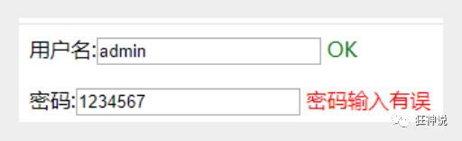{width="5.333333333333333in"
height="1.625in"}

获取baidu接口Demo

\<!DOCTYPE HTML\>

\<html\>

\<head\>

   \<meta http-equiv="Content-Type" content="text/html; charset=utf-8"\>

   \<title\>JSONP百度搜索\</title\>

   \<style\>

       #q{

           width: 500px;

           height: 30px;

           border:1px solid #ddd;

           line-height: 30px;

           display: block;

           margin: 0 auto;

           padding: 0 10px;

           font-size: 14px;

      }

       #ul{

           width: 520px;

           list-style: none;

           margin: 0 auto;

           padding: 0;

           border:1px solid #ddd;

           margin-top: -1px;

           display: none;

      }

       #ul li{

           line-height: 30px;

           padding: 0 10px;

      }

       #ul li:hover{

           background-color: #f60;

           color: #fff;

      }

   \</style\>

   \<script\>

       // 2.步骤二

       // 定义demo函数 (分析接口、数据)

       function demo(data){

           var Ul = document.getElementById('ul');

           var html = '';

           // 如果搜索数据存在 把内容添加进去

           if (data.s.length) {

               // 隐藏掉的ul显示出来

               Ul.style.display = 'block';

               // 搜索到的数据循环追加到li里

               for(var i = 0;i\<data.s.length;i++){

                   html += '\<li\>'+data.s\[i\]+'\</li\>';

              }

               // 循环的li写入ul

               Ul.innerHTML = html;

          }

      }

       // 1.步骤一

       window.onload = function(){

           // 获取输入框和ul

           var Q = document.getElementById('q');

           var Ul = document.getElementById('ul');

           // 事件鼠标抬起时候

           Q.onkeyup = function(){

               // 如果输入框不等于空

               if (this.value != '') {

                   // ☆☆☆☆☆☆☆☆☆☆☆☆☆☆☆☆☆☆JSONPz重点☆☆☆☆☆☆☆☆☆☆☆☆☆☆☆☆☆☆☆☆

                   // 创建标签

                   var script = document.createElement('script');

                   //给定要跨域的地址 赋值给src

                   //这里是要请求的跨域的地址 我写的是百度搜索的跨域地址

                 
 script.src = 'https://sp0.baidu.com/5a1Fazu8AA54nxGko9WTAnF6hhy/su?wd='+this.value+'&cb=demo';

                   // 将组合好的带src的script标签追加到body里

                   document.body.appendChild(script);

              }

          }

      }

   \</script\>

\</head\>

\<body\>

\<input type="text" id="q" /\>

\<ul id="ul"\>

\</ul\>

\</body\>

\</html\>

**5、拦截器**

**5.1、概述：**

SpringMVC的处理器拦截器类似于Servlet开发中的过滤器Filter,用于对处理器进行预处理和后处理。开发者可以自己定义一些拦截器来实现特定的功能。

**过滤器与拦截器的区别：**拦截器是AOP思想的具体应用。

**过滤器**

servlet规范中的一部分，任何java web工程都可以使用

在url-pattern中配置了/\*之后，可以对所有要访问的资源进行拦截

**拦截器**

拦截器是SpringMVC框架自己的，只有使用了SpringMVC框架的工程才能使用

拦截器只会拦截访问的控制器方法，
如果访问的是jsp/html/css/image/js是不会进行拦截的

**5.2、自定义拦截器**

那如何实现拦截器呢？

想要自定义拦截器，必须实现 HandlerInterceptor 接口。

1、新建一个Moudule ， springmvc-07-Interceptor  ， 添加web支持

2、配置web.xml 和 springmvc-servlet.xml 文件

3、编写一个拦截器

package com.kuang.interceptor;

import org.springframework.web.servlet.HandlerInterceptor;

import org.springframework.web.servlet.ModelAndView;

import javax.servlet.http.HttpServletRequest;

import javax.servlet.http.HttpServletResponse;

public class MyInterceptor implements HandlerInterceptor {

   //在请求处理的方法之前执行

   //如果返回true执行下一个拦截器

   //如果返回false就不执行下一个拦截器

 
 public boolean preHandle(HttpServletRequest httpServletRequest, HttpServletResponse httpServletResponse, Object o) throws Exception {

       System.out.println("------------处理前------------");

       return true;

  }

   //在请求处理方法执行之后执行

 
 public void postHandle(HttpServletRequest httpServletRequest, HttpServletResponse httpServletResponse, Object o, ModelAndView modelAndView) throws Exception {

       System.out.println("------------处理后------------");

  }

   //在dispatcherServlet处理后执行,做清理工作.

 
 public void afterCompletion(HttpServletRequest httpServletRequest, HttpServletResponse httpServletResponse, Object o, Exception e) throws Exception {

       System.out.println("------------清理------------");

  }

}

4、在springmvc的配置文件中配置拦截器

\<!--关于拦截器的配置--\>

\<mvc:interceptors\>

   \<mvc:interceptor\>

       \<!--/\*\* 包括路径及其子路径--\>

       \<!--/admin/\* 拦截的是/admin/add等等这种 ,
/admin/add/user不会被拦截--\>

       \<!--/admin/\*\* 拦截的是/admin/下的所有--\>

       \<mvc:mapping path="/\*\*"/\>

       \<!--bean配置的就是拦截器--\>

       \<bean class="com.kuang.interceptor.MyInterceptor"/\>

   \</mvc:interceptor\>

\</mvc:interceptors\>

5、编写一个Controller，接收请求

package com.kuang.controller;

import org.springframework.stereotype.Controller;

import org.springframework.web.bind.annotation.RequestMapping;

import org.springframework.web.bind.annotation.ResponseBody;

//测试拦截器的控制器

\@Controller

public class InterceptorController {

   @RequestMapping("/interceptor")

   @ResponseBody

   public String testFunction() {

       System.out.println("控制器中的方法执行了");

       return "hello";

  }

}

6、前端 index.jsp

\<a href="\${pageContext.request.contextPath}/interceptor"\>拦截器测试\</a\>

7、启动tomcat 测试一下！

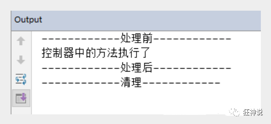{width="5.569444444444445in"
height="2.5448403324584428in"}

**5.3、验证用户是否登录 (认证用户)**

**实现思路**

1、有一个登陆页面，需要写一个controller访问页面。

2、登陆页面有一提交表单的动作。需要在controller中处理。判断用户名密码是否正确。如果正确，向session中写入用户信息。***返回登陆成功。***

3、拦截用户请求，判断用户是否登陆。如果用户已经登陆。放行，
如果用户未登陆，跳转到登陆页面

**测试：**

1、编写一个登陆页面  login.jsp

\<%@ page contentType="text/html;charset=UTF-8" language="java" %\>

\<html\>

\<head\>

   \<title\>Title\</title\>

\</head\>

\<h1\>登录页面\</h1\>

\<hr\>

\<body\>

\<form action="\${pageContext.request.contextPath}/user/login"\>

  用户名：\<input type="text" name="username"\> \<br\>

  密码：\<input type="password" name="pwd"\> \<br\>

   \<input type="submit" value="提交"\>

\</form\>

\</body\>

\</html\>

2、编写一个Controller处理请求

package com.kuang.controller;

import org.springframework.stereotype.Controller;

import org.springframework.web.bind.annotation.RequestMapping;

import javax.servlet.http.HttpSession;

\@Controller

\@RequestMapping("/user")

public class UserController {

   //跳转到登陆页面

   @RequestMapping("/jumplogin")

   public String jumpLogin() throws Exception {

       return "login";

  }

   //跳转到成功页面

   @RequestMapping("/jumpSuccess")

   public String jumpSuccess() throws Exception {

       return "success";

  }

   //登陆提交

   @RequestMapping("/login")

 
 public String login(HttpSession session, String username, String pwd) throws Exception {

       // 向session记录用户身份信息

       System.out.println("接收前端==="+username);

       session.setAttribute("user", username);

       return "success";

  }

   //退出登陆

   @RequestMapping("logout")

   public String logout(HttpSession session) throws Exception {

       // session 过期

       session.invalidate();

       return "login";

  }

}

3、编写一个登陆成功的页面 success.jsp

\<%@ page contentType="text/html;charset=UTF-8" language="java" %\>

\<html\>

\<head\>

   \<title\>Title\</title\>

\</head\>

\<body\>

\<h1\>登录成功页面\</h1\>

\<hr\>

\${user}

\<a href="\${pageContext.request.contextPath}/user/logout"\>注销\</a\>

\</body\>

\</html\>

4、在 index 页面上测试跳转！启动Tomcat 测试，未登录也可以进入主页！

\<%@ page contentType="text/html;charset=UTF-8" language="java" %\>

\<html\>

 \<head\>

   \<title\>\$Title\$\</title\>

 \</head\>

 \<body\>

 \<h1\>首页\</h1\>

 \<hr\>

\<%--登录--%\>

 \<a href="\${pageContext.request.contextPath}/user/jumplogin"\>登录\</a\>

 \<a href="\${pageContext.request.contextPath}/user/jumpSuccess"\>成功页面\</a\>

 \</body\>

\</html\>

5、编写用户登录拦截器

package com.kuang.interceptor;

import org.springframework.web.servlet.HandlerInterceptor;

import org.springframework.web.servlet.ModelAndView;

import javax.servlet.ServletException;

import javax.servlet.http.HttpServletRequest;

import javax.servlet.http.HttpServletResponse;

import javax.servlet.http.HttpSession;

import java.io.IOException;

public class LoginInterceptor implements HandlerInterceptor {

 
 public boolean preHandle(HttpServletRequest request, HttpServletResponse response, Object handler) throws ServletException, IOException {

       // 如果是登陆页面则放行

       System.out.println("uri: " + request.getRequestURI());

       if (request.getRequestURI().contains("login")) {

           return true;\*

      }

       HttpSession session = request.getSession();

       // 如果用户已登陆也放行

       if(session.getAttribute("user") != null) {

           return true;

      }

       // 用户没有登陆跳转到登陆页面

     
 request.getRequestDispatcher("/WEB-INF/jsp/login.jsp").forward(request, response);

       return false;

  }

 
 public void postHandle(HttpServletRequest httpServletRequest, HttpServletResponse httpServletResponse, Object o, ModelAndView modelAndView) throws Exception {

  }

   

 
 public void afterCompletion(HttpServletRequest httpServletRequest, HttpServletResponse httpServletResponse, Object o, Exception e) throws Exception {

  }

}

6、在Springmvc的配置文件中注册拦截器

\<!--关于拦截器的配置--\>

\<mvc:interceptors\>

   \<mvc:interceptor\>

       \<mvc:mapping path="/\*\*"/\>

     
 \<bean id="loginInterceptor" class="com.kuang.interceptor.LoginInterceptor"/\>

   \</mvc:interceptor\>

\</mvc:interceptors\>

7、再次重启Tomcat测试！

**6、文件上传和下载**

**6.1、准备工作**

文件上传是项目开发中最常见的功能之一 ,springMVC
可以很好的支持文件上传，但是SpringMVC上下文中默认没有装配MultipartResolver，因此默认情况下其不能处理文件上传工作。如果想使用Spring的文件上传功能，则需要在上下文中配置MultipartResolver。

前端表单要求：为了能上传文件，必须将表单的method设置为POST，并将enctype设置为multipart/form-data。只有在这样的情况下，浏览器才会把用户选择的文件以二进制数据发送给服务器；

**对表单中的 enctype 属性做个详细的说明：**

application/x-www=form-urlencoded：默认方式，只处理表单域中的 value
属性值，采用这种编码方式的表单会将表单域中的值处理成 URL 编码方式。

multipart/form-data：这种编码方式会以二进制流的方式来处理表单数据，这种编码方式会把文件域指定文件的内容也封装到请求参数中，不会对字符编码。

text/plain：除了把空格转换为 "+"
号外，其他字符都不做编码处理，这种方式适用直接通过表单发送邮件。

\<form action="" enctype="multipart/form-data" method="post"\>

   \<input type="file" name="file"/\>

   \<input type="submit"\>

\</form\>

一旦设置了enctype为multipart/form-data，浏览器即会采用二进制流的方式来处理表单数据，而对于文件上传的处理则涉及在服务器端解析原始的HTTP响应。在2003年，Apache
Software Foundation发布了开源的Commons
FileUpload组件，其很快成为Servlet/JSP程序员上传文件的最佳选择。

Servlet3.0规范已经提供方法来处理文件上传，但这种上传需要在Servlet中完成。

而Spring MVC则提供了更简单的封装。

Spring
MVC为文件上传提供了直接的支持，这种支持是用即插即用的MultipartResolver实现的。

Spring MVC使用Apache Commons
FileUpload技术实现了一个MultipartResolver实现类：

CommonsMultipartResolver。因此，SpringMVC的文件上传还需要依赖Apache
Commons FileUpload的组件。

**6.2、文件上传**

1、导入文件上传的jar包，commons-fileupload ，
Maven会自动帮我们导入他的依赖包 commons-io包；

\<!--文件上传--\>

\<dependency\>

   \<groupId\>commons-fileupload\</groupId\>

   \<artifactId\>commons-fileupload\</artifactId\>

   \<version\>1.3.3\</version\>

\</dependency\>

\<!--servlet-api导入高版本的--\>

\<dependency\>

   \<groupId\>javax.servlet\</groupId\>

   \<artifactId\>javax.servlet-api\</artifactId\>

   \<version\>4.0.1\</version\>

\</dependency\>

2、配置bean：multipartResolver

【**注意！！！这个bena的id必须为：multipartResolver ，
否则上传文件会报400的错误！在这里栽过坑,教训！**】

\<!--文件上传配置--\>

\<bean id="multipartResolver"  class="org.springframework.web.multipart.commons.CommonsMultipartResolver"\>

   \<!--
请求的编码格式，必须和jSP的pageEncoding属性一致，以便正确读取表单的内容，默认为ISO-8859-1
--\>

   \<property name="defaultEncoding" value="utf-8"/\>

   \<!-- 上传文件大小上限，单位为字节（10485760=10M） --\>

   \<property name="maxUploadSize" value="10485760"/\>

   \<property name="maxInMemorySize" value="40960"/\>

\</bean\>

CommonsMultipartFile 的 常用方法：

**String getOriginalFilename()：获取上传文件的原名**

**InputStream getInputStream()：获取文件流**

**void transferTo(File dest)：将上传文件保存到一个目录文件中**

我们去实际测试一下

3、编写前端页面

\<form action="/upload" enctype="multipart/form-data" method="post"\>

 \<input type="file" name="file"/\>

 \<input type="submit" value="upload"\>

\</form\>

4、**Controller**

package com.kuang.controller;

import org.springframework.stereotype.Controller;

import org.springframework.web.bind.annotation.RequestMapping;

import org.springframework.web.bind.annotation.RequestParam;

import org.springframework.web.multipart.commons.CommonsMultipartFile;

import javax.servlet.http.HttpServletRequest;

import java.io.\*;

\@Controller

public class FileController {

   //@RequestParam("file")
将name=file控件得到的文件封装成CommonsMultipartFile 对象

   //批量上传CommonsMultipartFile则为数组即可

   @RequestMapping("/upload")

 
 public String fileUpload(@RequestParam("file") CommonsMultipartFile file , HttpServletRequest request) throws IOException {

       //获取文件名 : file.getOriginalFilename();

       String uploadFileName = file.getOriginalFilename();

       //如果文件名为空，直接回到首页！

       if ("".equals(uploadFileName)){

           return "redirect:/index.jsp";

      }

       System.out.println("上传文件名 : "+uploadFileName);

       //上传路径保存设置

       String path = request.getServletContext().getRealPath("/upload");

       //如果路径不存在，创建一个

       File realPath = new File(path);

       if (!realPath.exists()){

           realPath.mkdir();

      }

       System.out.println("上传文件保存地址："+realPath);

       InputStream is = file.getInputStream(); //文件输入流

     
 OutputStream os = new FileOutputStream(new File(realPath,uploadFileName)); //文件输出流

       //读取写出

       int len=0;

       byte\[\] buffer = new byte\[1024\];

       while ((len=is.read(buffer))!=-1){

           os.write(buffer,0,len);

           os.flush();

      }

       os.close();

       is.close();

       return "redirect:/index.jsp";

  }

}

5、测试上传文件，OK！

**采用file.Transto 来保存上传的文件**

1、编写Controller

/\*

\* 采用file.Transto 来保存上传的文件

\*/

\@RequestMapping("/upload2")

public String  fileUpload2(@RequestParam("file") CommonsMultipartFile file, HttpServletRequest request) throws IOException {

   //上传路径保存设置

   String path = request.getServletContext().getRealPath("/upload");

   File realPath = new File(path);

   if (!realPath.exists()){

       realPath.mkdir();

  }

   //上传文件地址

   System.out.println("上传文件保存地址："+realPath);

   //通过CommonsMultipartFile的方法直接写文件（注意这个时候）

   file.transferTo(new File(realPath +"/"+ file.getOriginalFilename()));

   return "redirect:/index.jsp";

}

2、前端表单提交地址修改

3、访问提交测试，OK！

**6.3、文件下载**

**文件下载步骤：**

1、设置 response 响应头

2、读取文件 -- InputStream

3、写出文件 -- OutputStream

4、执行操作

5、关闭流 （先开后关）

**代码实现：**

\@RequestMapping(value="/download")

public String downloads(HttpServletResponse response ,HttpServletRequest request) throws Exception{

   //要下载的图片地址

   String  path = request.getServletContext().getRealPath("/upload");

   String  fileName = "基础语法.jpg";

   //1、设置response 响应头

   response.reset(); //设置页面不缓存,清空buffer

   response.setCharacterEncoding("UTF-8"); //字符编码

   response.setContentType("multipart/form-data"); //二进制传输数据

   //设置响应头

   response.setHeader("Content-Disposition",

           "attachment;fileName="+URLEncoder.encode(fileName, "UTF-8"));

   File file = new File(path,fileName);

   //2、 读取文件--输入流

   InputStream input=new FileInputStream(file);

   //3、 写出文件--输出流

   OutputStream out = response.getOutputStream();

   byte\[\] buff =new byte\[1024\];

   int index=0;

   //4、执行 写出操作

   while((index= input.read(buff))!= -1){

       out.write(buff, 0, index);

       out.flush();

  }

   out.close();

   input.close();

   return null;

}

前端

\<a href="/download"\>点击下载\</a\>

测试，文件下载OK，大家可以和我们之前学习的JavaWeb原生的方式对比一下，就可以知道这个便捷多了!
