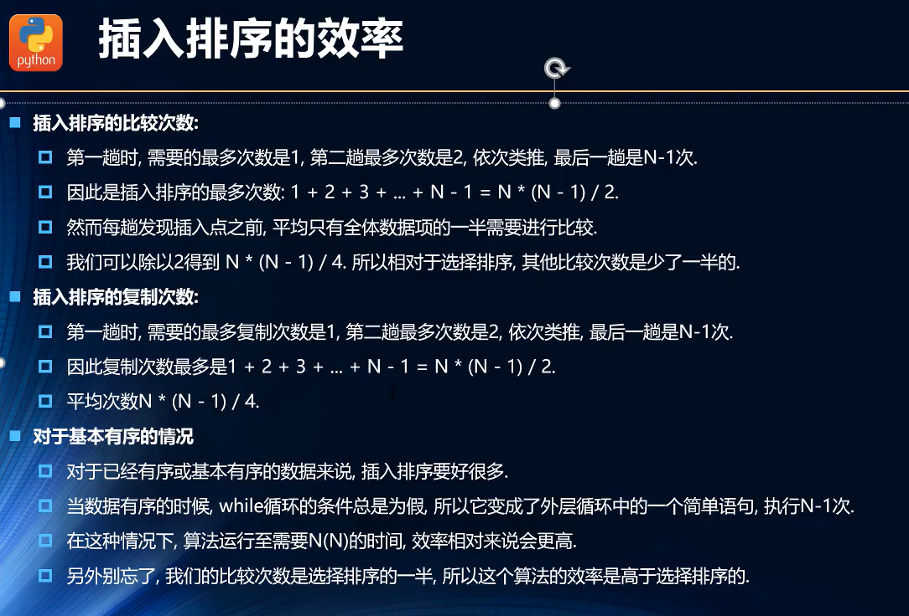

**1、选择排序**

**什么是选择排序**

{width="5.416666666666667in"
height="3.0852351268591427in"}

选择排序是一种简单直观的排序算法

**工作原理**

第一次从待排序的数据元素中选出最大（最小）的一个元素，存放在序列的起始位置，然后再从剩余未排序元素中寻找到最大\[\[（最小）元素，放置到已排序的序列的末端。（先找出最值，然后交换位置）

**选择排序是不稳定的排序方法。**

**实现**

// 找到最小值的下标

let minIndex = (numbers) =\> {

if(numbers.length \> 2){

let index = 0;

for(let i = 1; i \< numbers.length; i++){

index = numbers\[i\] \< numbers\[index\] ? i : index;

}

return index;

}else{

return numbers\[0\] \< numbers\[1\] ? 0 : 1;

}

}

// 交换两数

function swap(array, i, j) {

let temp = array\[i\]

array\[i\] = array\[j\]

array\[j\] = temp

}

// 排序

let sort = (numbers) =\> {

for(let i = 0; i \< numbers.length - 1; i++){

let index = minIndex(numbers.slice(i)) + i; // 每次从第 i 个元素往后找

if(i != index){ // 当前位置为合适位置

swap(numbers,i,index);

}

}

return numbers;

}

**2、冒泡排序**

每次循环可将最大值置于末端：

{width="4.236111111111111in"
height="2.1216032370953632in"}

**代码实现：**

// 3、实现排序算法

// 冒泡排序

ArrayList.prototype.bubbleSort = function (){

var length = this.array.length;

for(var j = length-1; j \>= 0; j--){

for(var i = 0; i \< j; i++){

if(this.array\[i\]\>this.array\[i+1\]){

this.swap(i,i+1);

}

}

}

}

**冒泡排序的效率：**

比较次数：

N+(N-1)+(N-2)+ ... +1 = (N²-N) / 2 \~\~ O(N²)

交换次数：假设平均比较两次会交换一次

(N²-N) / 4 \~\~ O(N²)

**3、插入排序**

**思路**

{width="5.694444444444445in"
height="2.995702099737533in"}

**代码实现**

// 插入排序

ArrayList.prototype.insertionSort = function () {

let length = this.array.length;

for (let i = 1; i \< length; i++) {

let temp = this.array\[i\];

let j = i;

// 局部有序部分进行插入排序

while (temp \< this.array\[j - 1\] && j \> 0) {

this.array\[j\] = this.array\[j - 1\];

j--;

}

this.array\[j\] = temp;

}

}

**效率**

{width="5.694444444444445in"
height="3.8663385826771655in"}

**4、希尔排序**

{width="5.694444444444445in"
height="2.953821084864392in"}

{width="5.694444444444445in"
height="3.1158923884514436in"}

{width="5.694444444444445in"
height="3.2962281277340333in"}

**增量的确定**

{width="5.305555555555555in"
height="3.1097801837270342in"}

**代码实现**

// 希尔排序

ArrayList.prototype.shellSort = function () {

let length = this.array.length;

let gap = Math.floor(length / 2);

while (gap \>= 1) {

for (let i = gap; i \< length; i++) {

let temp = this.array\[i\];

let j = i;

while (temp \< this.array\[j - gap\] && j \> gap + 1) {

this.array\[j\] = this.array\[j - gap\];

j -= gap;

}

this.array\[j\] = temp;

}

gap = Math.floor(gap / 2);

}

}

**执行效率:**

希尔排序的效率与增量有关

在希尔的原稿中，增量定位 N / 2

希尔排序的效率很难证明，但经过统计，使用希尔排序的原始增量，最坏的情况下时间复杂度为
O(N\^2)，通常情况下都要好于 O(N\^2)

**5、快速排序**

快速排序是冒泡排序的升级版，几乎是目前所有排序算法中，最快的一种排序算法。

**快速排序的思想：**

快速排序是在一次循环中，找出任意元素的一个正确位置，并且在后续排序中不需要进行移动；

其思想是分而治之

{width="5.694444444444445in"
height="3.113941382327209in"}

**枢纽的选择：**

取三位数：arr\[left\], arr\[right\],
arr\[(left+right)/2\],进行排序，将倒数第二的位中位数放在置。

**代码的实现：**

// 快速排序 枢纽的选择

ArrayList.prototype.medain = function (left, right) {

let center = Math.floor((left + right) / 2);

if (this.array\[left\] \> this.array\[right\]) {

this.swap(left, right);

}

if (this.array\[center\] \< this.array\[left\]) {

this.swap(center, left);

} else if (this.array\[right\] \< this.array\[center\]) {

this.swap(right, center);

}

this.swap(center, right - 1);

return this.array\[right - 1\];

}

// 快速排序里递归函数的实现

ArrayList.prototype.fast = function (left, right) {

if (left \>= right) { return; }

//获取枢纽

let pivot = this.medain(left, right);

//记录下指针，避免修改 left and right

let i = left;

let j = right - 1;

// 移动指针

while (i \< j) {

while (this.array\[++i\] \< pivot) { }

while (this.array\[--j\] \> pivot) { }

if (i \< j) {

this.swap(i, j);

} else {

break;

}

}

// 确定枢纽的位置

this.swap(i, right - 1);

// 递归实现 分而治之

this.fast(left, i - 1);

this.fast(i + 1, right);

}

// 快速排序

ArrayList.prototype.fastSort = function () {

this.fast(0, this.array.length - 1);

}

**效率：O(nlogn)**

其他版本

{width="3.9027777777777777in"
height="2.783423009623797in"}

**6、归并排序**

{width="3.3194444444444446in"
height="2.408505030621172in"}

{width="3.3055555555555554in"
height="1.122703412073491in"}

{width="4.055555555555555in"
height="3.1617957130358705in"}

**7、计数排序**

{width="5.760416666666667in"
height="2.505579615048119in"}

{width="5.013888888888889in"
height="3.5484765966754157in"}
