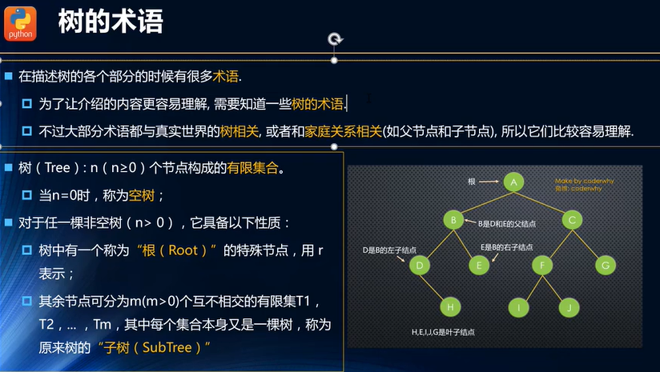
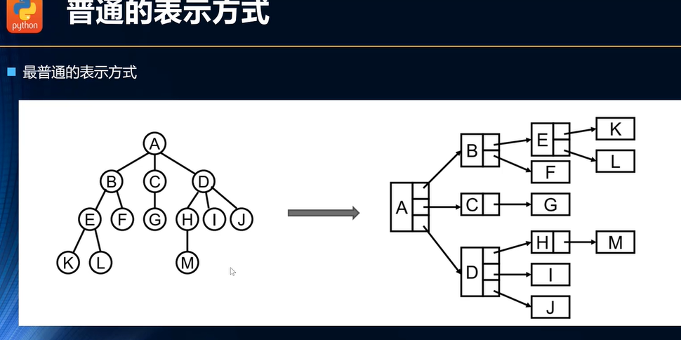
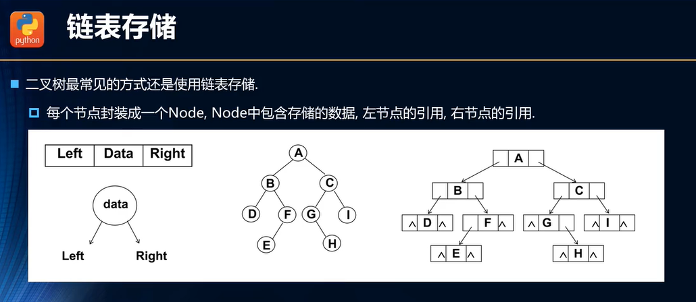

**树的优点**

{width="5.760416666666667in"
height="3.1519258530183727in"}

{width="5.760416666666667in"
height="2.69045384951881in"}

**树的术语**

{width="5.111111111111111in"
height="2.884304461942257in"}

{width="5.760416666666667in"
height="2.5877143482064744in"}

**树的表示**

{width="4.694444444444445in"
height="2.3423829833770777in"}

{width="4.722222222222222in"
height="2.7312620297462815in"}

{width="4.736111111111111in"
height="2.3237106299212598in"}

**二叉树**

{width="5.486111111111111in"
height="3.074811898512686in"}

{width="5.760416666666667in"
height="3.1876465441819772in"}

{width="5.222222222222222in"
height="3.4648042432195973in"}

{width="4.777777777777778in"
height="3.5231364829396323in"}

**二叉树的表示方法**

{width="5.416666666666667in"
height="3.054897200349956in"}

{width="5.055555555555555in"
height="2.198921697287839in"}

**二叉搜索树BST**

{width="5.305555555555555in"
height="3.039258530183727in"}

**二叉搜索树的封装**

{width="4.958333333333333in"
height="3.2622517497812775in"}

**二叉搜索树的常见操作**

{width="5.760416666666667in"
height="3.0530205599300086in"}

**平衡二叉树**

{width="5.319444444444445in"
height="2.8423753280839894in"}

{width="4.861111111111111in"
height="2.9855238407699036in"}

**红黑树**

{width="5.263888888888889in"
height="2.8165988626421696in"}

**红黑树的规则**

{width="5.760416666666667in"
height="3.0025535870516187in"}

**红黑树的相对平衡**

{width="4.75in"
height="3.638436132983377in"}
