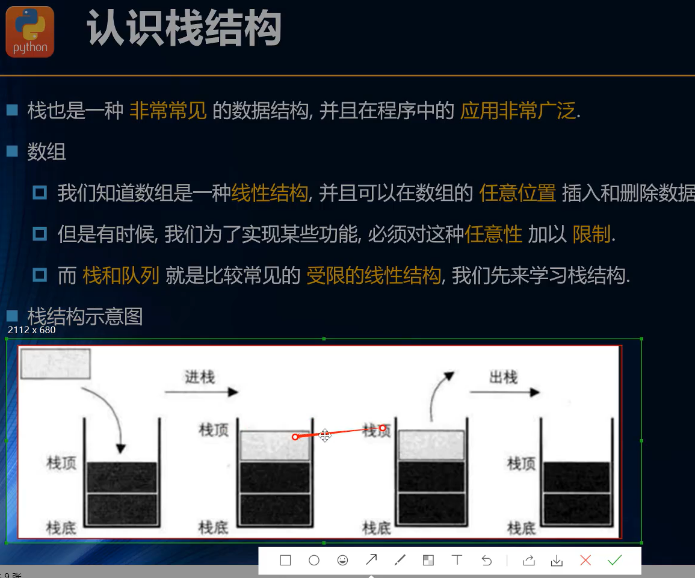
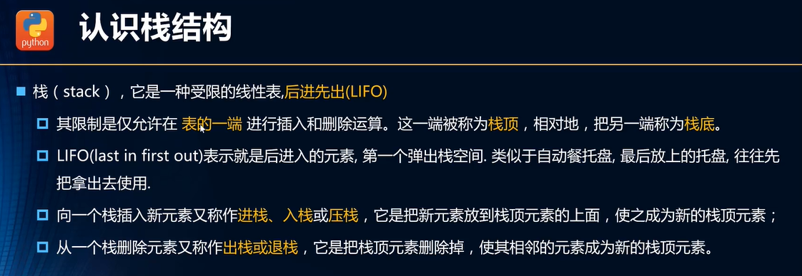
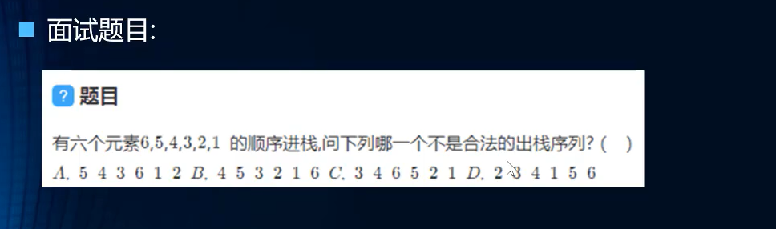
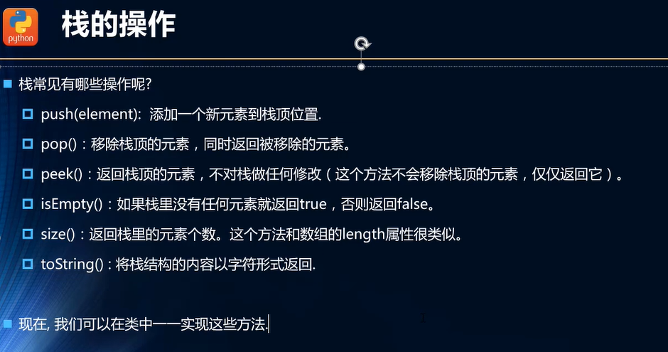
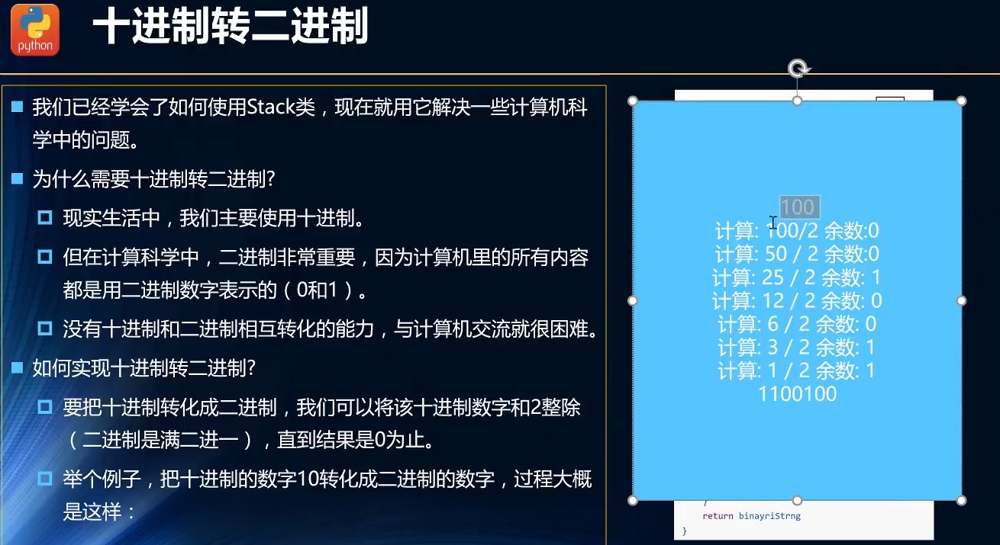
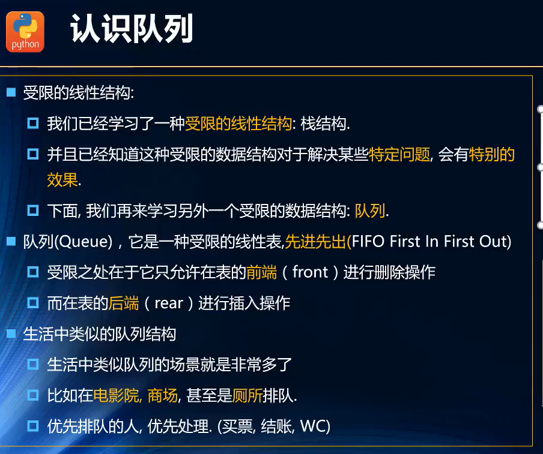
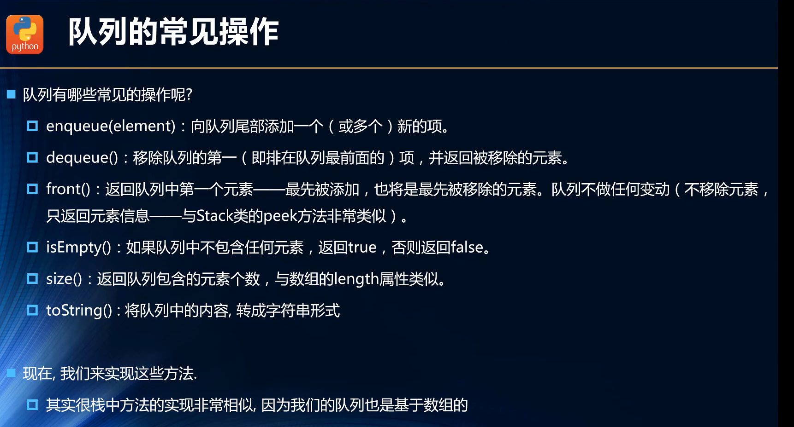
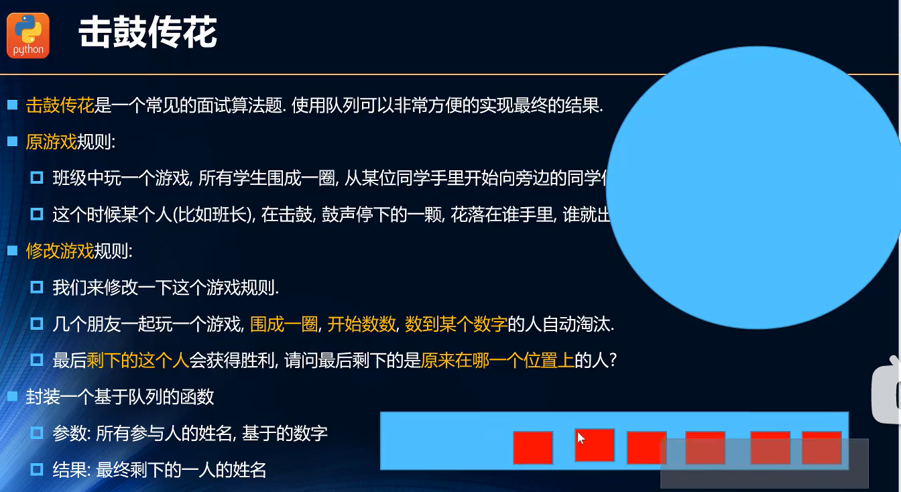
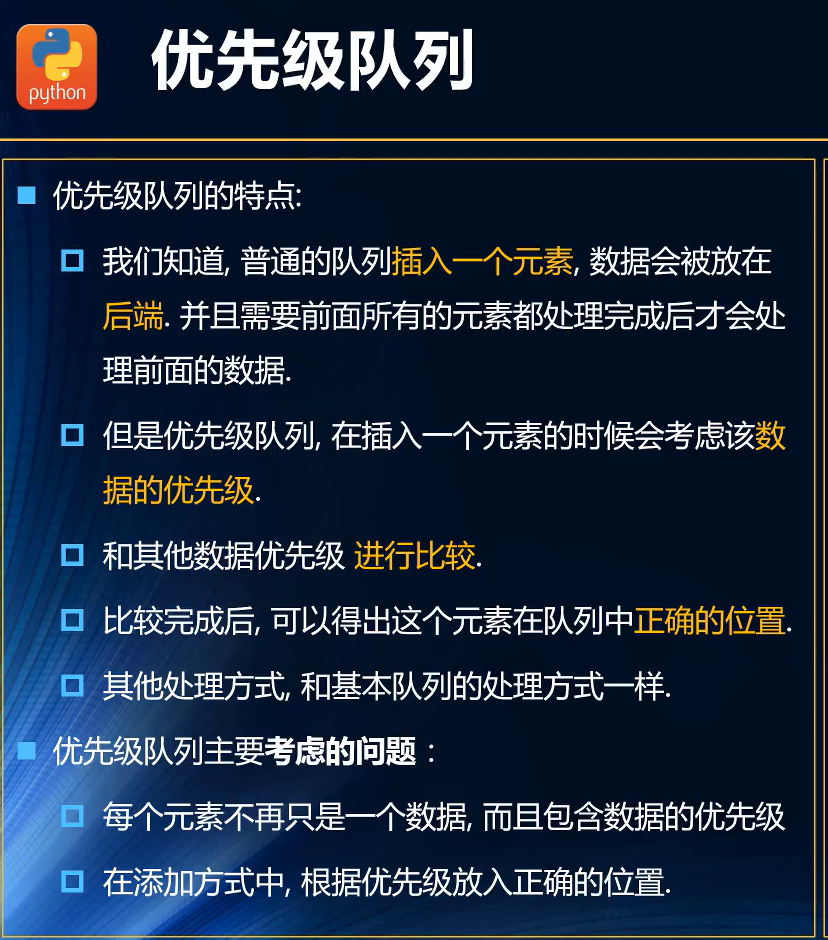
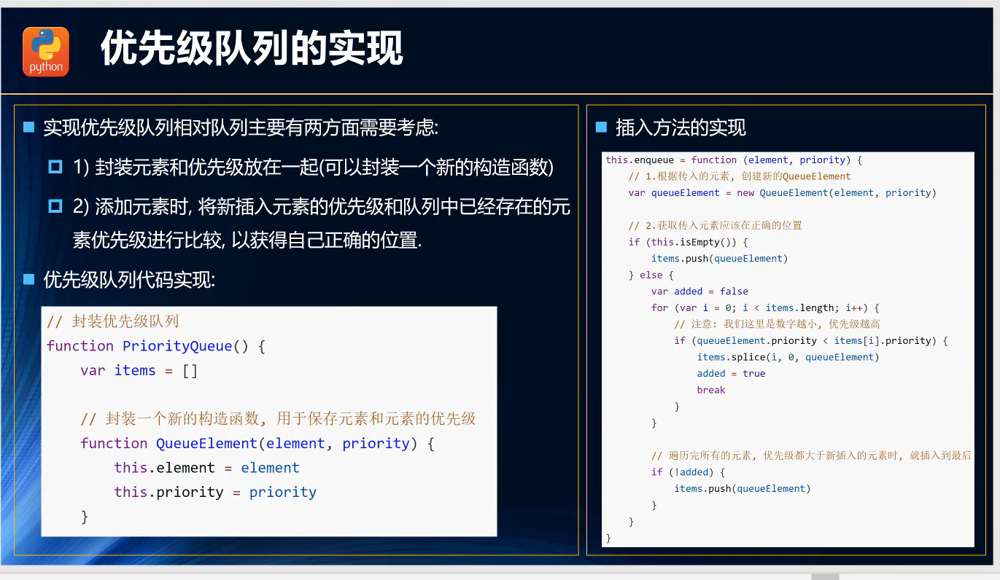

**1、数组**

Jscript 的数组实际上是对 API　的调用

基本操作：增删查改，排序，反转，迭代，转化

**2、栈**

**栈的认识**

{width="3.986111111111111in"
height="3.316582458442695in"}

**栈的特点：后进先出**

{width="5.694444444444445in"
height="1.9692016622922135in"}

**栈结构的面试题：C**

{width="5.694444444444445in"
height="1.6824496937882765in"}

**栈的操作**

{width="5.694444444444445in"
height="2.9986701662292212in"}

**栈的实现**

实现栈由两种比较常见的方式：

基于数组实现

基于链表实现

**代码实现**

// 封装一个 Stack 类

function Stack() {

// 栈中的属性(往Stack的示例对象身上添加了一个items属性)

this.items = \[\];

// 栈的基本操作

// 1.入栈：添加一个新元素到栈顶位置

Stack.prototype.push = function (element) {

return this.items.push(element);

}

// 2.出栈：从栈顶位置删除一个元素

Stack.prototype.pop = function () {

return this.items.pop();

}

// 3.查看栈顶元素

Stack.prototype.peek = function () {

return this.items\[this.items.length - 1\];

}

// 4.判断栈是否为空

Stack.prototype.isEmpty = function () {

return this.items.length == 0;

}

// 5.查看栈的大小

Stack.prototype.size = function () {

return this.items.length;

}

// 6.将栈结构的内容以字符串形式返回

Stack.prototype.toString = function () {

let str = '';

for (let i = 0; i \< this.items.length; i++) {

str += this.items\[i\] + ' ';

}

return str;

}

}

let s = new Stack();

s.push(100);

s.push(88);

s.push(28);

s.push(67);

**十进制转二进制**

{width="4.944444444444445in"
height="2.698685476815398in"}

代码的实现

// 7.将十进制数转化为二进制

Stack.prototype.dec2bin = function (decNumber) {

this.items = \[\];

while (decNumber \> 0) {

// 取余数并压入栈顶

this.push(decNumber % 2);

decNumber = Math.floor(decNumber / 2);

}

let binaryString = '';

while (!this.isEmpty()) {

binaryString += this.pop(); // 将栈内元素依次输出，按照后入先出的顺序

}

return binaryString;

}

**3、队列**

**队列的认识：FIFO**

{width="3.9166666666666665in"
height="3.2797758092738407in"}

**队列的创建（基于数组）**

{width="5.694444444444445in"
height="3.0687839020122483in"}

function Queue() {

// 队列的属性

this.item = \[\];

// 队列的基本操作：

// 向队列尾部添加一个属性

Queue.prototype.enqueue = function (element) {

this.item.push(element);

}

// 移除队列头部的一个属性，并返回被移除的元素

Queue.prototype.dequeue = function () {

return this.item.shift();

}

// 返回队列头部的一个元素，只读不改

Queue.prototype.front = function () {

return this.item\[0\];

}

// 判空

Queue.prototype.isEmpty = function () {

return this.item.length === 0;

}

// 查看队列的大小

Queue.prototype.size = function () {

return this.item.length;

}

// 将队列的内容转成字符串形式

Queue.prototype.toString = function () {

let res = '';

for (let i = 0; i \< this.item.length; i++) {

res += this.item\[i\] + '';

}

return res;

}

}

**面试题-击鼓传花**

{width="5.472222222222222in"
height="2.988549868766404in"}

// 面试题：击鼓传花

function passGame(nameList, num) {

let q = new Queue();

// 1、将游戏参与者添加到队列当中

for (let i = 0; i \< nameList.length; i++) {

q.enqueue(nameList\[i\]);

}

// 2、循环队列，将普通参与者从队列头部删除，再添加到队列尾部

while (q.size() \> 1) {

for (let i = 0; i \< num - 1; i++) {

q.enqueue(q.dequeue());

}

// 将排名第num的参与则从队列中删除

q.dequeue();

}

console.log('获胜者是：'+q.front());

console.log('在原数组的下标为：'+nameList.indexOf(q.front()))

return nameList.indexOf(q.front())

}

let name=\['lili','张三','李四','王五'\];

passGame(name,3)

**优先级队列**

**认识**

{width="3.9166666666666665in"
height="4.446457786526684in"}

{width="5.694444444444445in"
height="3.3061843832021in"}

**封装**

function PriorityQueue() {

this.items = \[\];

// 封装一个新的构造函数，用于保存元素和元素的优先级

function QueueElement(element, priority) {

this.element = element;

this.priority = priority;

}

// 实现插入方法

PriorityQueue.prototype.enqueue = function (element, priority) {

let queueElement = new QueueElement(element, priority);

// 队列为空，直接进入队列

if (this.items.length === 0) {

this.items.push(queueElement);

} else {

let flag = false;

// 比较优先级

for (let i = 0; i \< this.items.length; i++) {

if (queueElement.priority \< this.items\[i\].priority) {

this.items.splice(i, 0, queueElement);

flag = true;

break;

}

}

if(!flag){

this.items.push(queueElement);

}

}

return this.items;

}

}

完整代码：

function PriorityQueue() {

this.items = \[\];

// 封装一个新的构造函数，用于保存元素和元素的优先级

function QueueElement(element, priority) {

this.element = element;

this.priority = priority;

}

// 实现插入方法

PriorityQueue.prototype.enqueue = function (element, priority) {

let queueElement = new QueueElement(element, priority);

// 队列为空，直接进入队列

if (this.items.length === 0) {

this.items.push(queueElement);

} else {

let flag = false;

// 比较优先级

for (let i = 0; i \< this.items.length; i++) {

if (queueElement.priority \< this.items\[i\].priority) {

this.items.splice(i, 0, queueElement);

flag = true;

break;

}

}

if(!flag){

this.items.push(queueElement);

}

}

return this.items;

}

// 移除队列头部的一个属性，并返回被移除的元素

PriorityQueue.prototype.dequeue = function () {

return this.items.shift();

}

// 返回队列头部的一个元素，只读不改

PriorityQueue.prototype.front = function () {

return this.items\[0\];

}

// 判空

PriorityQueue.prototype.isEmpty = function () {

return this.items.length === 0;

}

// 查看队列的大小

PriorityQueue.prototype.size = function () {

return this.items.length;

}

// 将队列的内容转成字符串形式

PriorityQueue.prototype.toString = function () {

let res = '';

for (let i = 0; i \< this.items.length; i++) {

res += this.items\[i\].element + '-'+this.items\[i\].priority+' ';

}

return res;

}

}

**4、链表**
