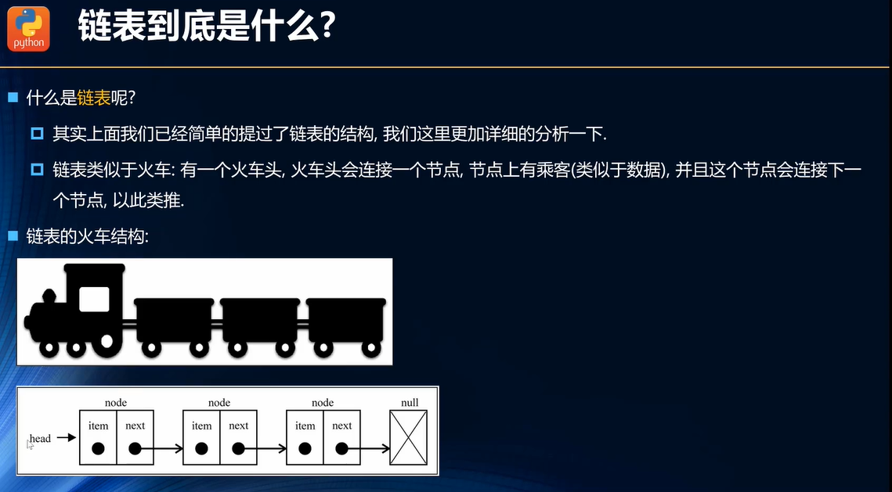

**链表以及数组的缺点**

{width="5.760416666666667in"
height="3.182328302712161in"}

**链表的优势**

{width="5.760416666666667in"
height="3.1480752405949257in"}

**链表是什么？**

{width="5.760416666666667in"
height="3.1811253280839895in"}

**链表结构的封装**

{width="5.760416666666667in"
height="3.1888024934383203in"}

**链表常见操作**

{width="5.760416666666667in"
height="3.177270341207349in"}

代码实现：

\<script\>

function LinkedList() {

// 封装一个Node类，用于记录每一个节点

function Node(data) {

this.data = data;

this.next = null;

}

// 属性

this.head = null;

this.length = 0;

// 1、追加方法

LinkedList.prototype.append = function (data) {

// 1、创建新节点

let newNode = new Node(data);

// 2、判断是否为头节点

if (this.length === 0) {

this.head = newNode;

} else {

let current = this.head;

while (current.next) { // 找到最后一个节点

current = current.next;

}

current.next = newNode;

}

// 3、长度+1

this.length += 1;

}

// 2、toString 方法

LinkedList.prototype.toString = function () {

let current = this.head;

let listString = ''

while (current) {

listString += current.data + ' ';

current = current.next;

}

return listString

}

// 3、insert 方法

LinkedList.prototype.insert = function (position, data) {

// 1、判断数组越界

if (position \< 0 \|\| position \> this.length) return new
Error('插入下标越界');

// 2、创建节点

let newNode = new Node(data);

if (position === 0) {

newNode.next = this.head;

this.head = newNode

} else {

let index = 0;

let current = this.head;

let previous = null;

while (index++ !== position) {

previous = current;

current = current.next;

}

newNode.next = current;

previous.next = newNode;

}

this.length += 1;

}

// 4.get方法

LinkedList.prototype.get = function (position) {

if (position \< 0 \|\| position \>= this.length) return new
Error('下标越界');

let current = this.head;

let index = 0;

while (index++ \< position) {

current = current.next;

}

return current.data;

}

// 5.indexOf

LinkedList.prototype.indexOf = function (element) {

let current = this.head;

let index = 0;

while (current) {

if (element === current.data) {

return index;

}

index += 1;

current = current.next;

}

return -1;

}

// 6、update

LinkedList.prototype.update = function (position, newData) {

if (position \< 0 \|\| position \>= this.length) return new
Error('下标越界');

let current = this.head;

let index = 0;

while (index++ !== position) {

current = current.next;

}

current.data = newData

return true

}

// 7、removeAt

LinkedList.prototype.removeAt = function (position) {

if (position \< 0 \|\| position \>= this.length) return null;

if (position === 0) {

this.head = this.head.next;

} else {

let previous = null;

let current = this.head;

let index = 0;

while (index++ !== position) {

previous = current;

current = current.next;

}

previous.next = current.next;

}

this.length -= 1;

return true;

}

// 8、remove

LinkedList.prototype.remove = function (element) {

let position = this.indexOf(element);

return this.removeAt(position);

}

// 9、isEmpty

LinkedList.prototype.isEmpty = function () {

return this.length === 0;

}

// 10、size

LinkedList.prototype.size = function () {

return this.length;

}

}

// 测试

let ll = new LinkedList();

// 添加

ll.append('abc');

ll.append('efg');

ll.append('qwe');

ll.append('asd');

// 插入

ll.insert(1, '123')

// get

console.log('get ' + ll.get(1));

// indexOf

console.log('indexOf as:' + ll.indexOf('as'));

// update

ll.update(1, '456')

// 7、removeAt

ll.removeAt(0)

// 8、remove

ll.remove('ef')

// 9、isEmpty

console.log('isEmpty:' + ll.isEmpty());

// 10、size

console.log('size:' + ll.size());

console.log('tostring:' + ll.toString())

console.log(ll);

\</script\>
